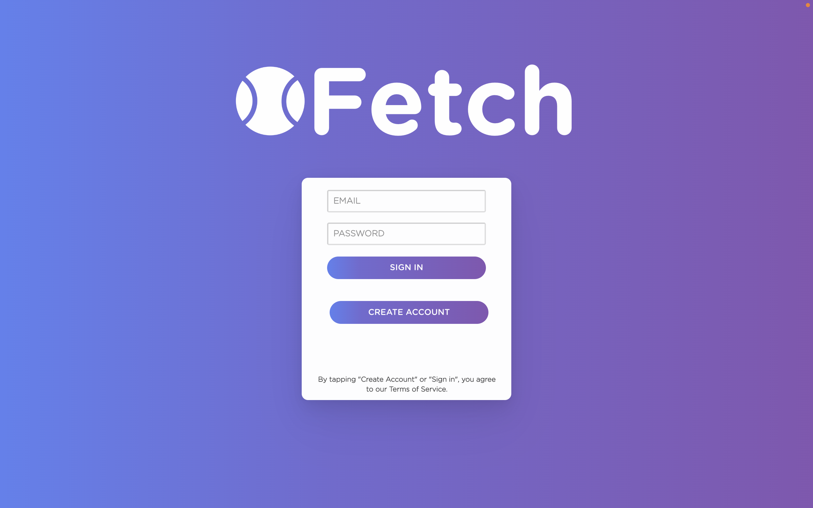
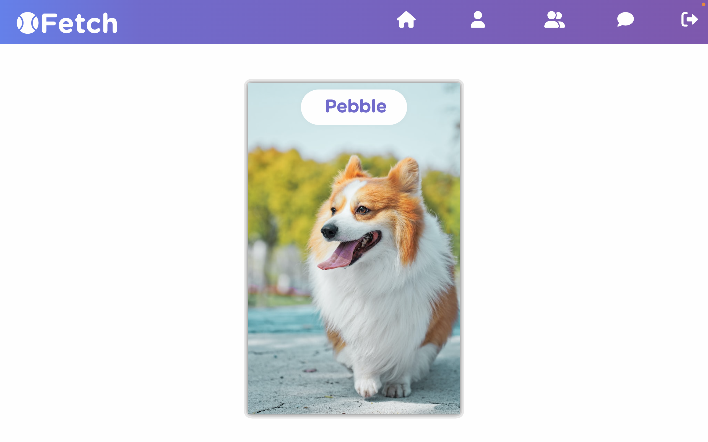
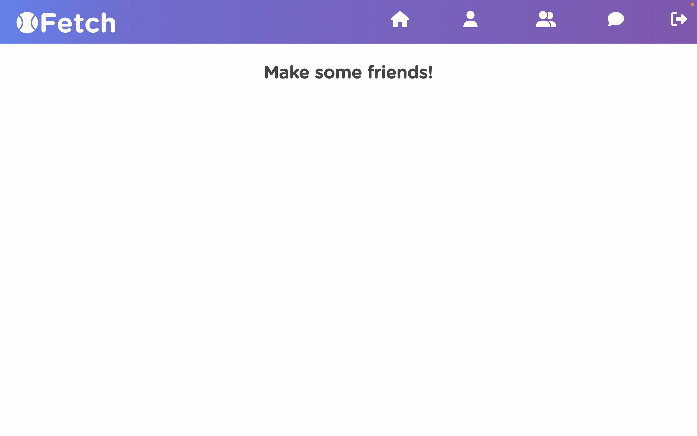
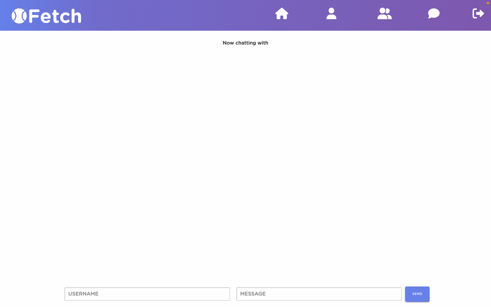

# Fetch

  
  
  
  
  

## Table Of Contents:
- [Fetch](#fetch)
  - [Table Of Contents:](#table-of-contents)
  - [Description](#description)
  - [Usage](#usage)
  - [Links](#links)
  - [Contribution](#contribution)

## Description 
Social Networking application where users can interact with fellow dog lovers and create connections 

## Usage
* React
* GraphQL
* JWT
* MongoDB
 
## Links 
[Deployed Website](https://ohfetch.herokuapp.com/)

## Contribution
Made by [Charles Houston](https://github.com/gnartistic), [Elena Carey](https://github.com/elenalaree), [Amin Albatayneh](https://github.com/oameeno), & [Jesse Ponce](https://github.com/Soulreaper077). © 2022
